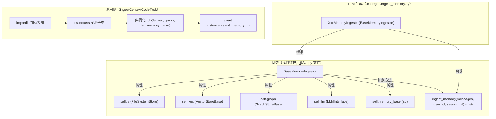

# 代码生成重构方案：抽象基类 + importlib 动态加载

## 1. 背景与问题

### 1.1 当前方案

当前 `ConsolidateContextCodeT2Task` 生成摄入/消费代码的流程：

1. 在 `consolidate_context_code_task.py` 中定义了 `INGEST_CODE_SKELETON` 和 `CONSUME_CODE_SKELETON` 两个大型字符串模板（各约 150 行）
2. LLM 生成核心函数体（`ingest_memory` / `retrieve_memory`）
3. 通过 `.format()` 将函数体嵌入骨架模板，拼接为完整的 `.py` 脚本
4. `IngestContextCodeTask` 通过 **subprocess** 执行生成的脚本，传递命令行参数

### 1.2 痛点

| 问题 | 说明 |
|------|------|
| **写困难** | 模板使用 `.format()`，所有 `{}` 必须转义为 `{{}}`，不是合法 Python，IDE 无法高亮/补全 |
| **测试困难** | 模板无法直接 lint/import 验证，必须走完整 LLM 流程才能验证 |
| **维护困难** | 两个骨架模板 ~300 行嵌在业务文件中，文件膨胀到 832 行 |
| **性能开销** | subprocess 每次启动新进程 + 重新序列化/反序列化所有 Store |
| **调试困难** | 子进程错误只能通过 stderr 文本解析，无法断点调试 |
| **LLM 生成量大** | 需要生成完整脚本（含 CLI 入口、Store 初始化等），出错概率高 |

## 2. 目标方案

### 2.1 核心思路

```
定义抽象基类 BaseMemoryIngestor / BaseMemoryConsumer
    → LLM 只需生成一个继承子类，实现关键抽象方法
    → 调用侧通过 importlib 动态加载子类
    → 直接在进程内实例化并调用
```

### 2.2 架构图



## 3. 详细设计

### 3.1 目录结构

```
context_task/
  codegen/
    __init__.py
    base_memory_ingestor.py      # 摄入抽象基类
    base_memory_consumer.py      # 消费抽象基类
    loader.py                    # importlib 动态加载器

# 用户维度生成的代码（运行时产物，路径不变）
<user_memory_base>/
  .codegen/
    ingest_memory.py             # LLM 生成的摄入子类
    retrieve_memory.py           # LLM 生成的消费子类
    snapshots/                   # 快照备份（不变）
```

### 3.2 BaseMemoryIngestor 基类

```python
# context_task/codegen/base_memory_ingestor.py
"""记忆摄入抽象基类。

本文件是合法的 Python 模块，可以直接 import、lint、测试。
LLM 只需生成一个继承本类的子类，实现 ingest_memory 抽象方法。
"""

from __future__ import annotations

from abc import ABC, abstractmethod
from typing import Any


class BaseMemoryIngestor(ABC):
    """记忆摄入基类。

    子类只需实现 ingest_memory 方法。
    通过 self.fs / self.vec / self.graph / self.llm / self.memory_base 访问依赖。

    Attributes:
        fs: FileSystemStore 实例
        vec: VectorStoreBase 实例（可能为 None）
        graph: GraphStoreBase 实例（可能为 None）
        llm: LLMInterface 实例（可能为 None）
        memory_base: 记忆库根目录路径
    """

    def __init__(
        self,
        fs=None,
        vec=None,
        graph=None,
        llm=None,
        memory_base: str = "",
    ):
        self.fs = fs
        self.vec = vec
        self.graph = graph
        self.llm = llm
        self.memory_base = memory_base

    @abstractmethod
    async def ingest_memory(
        self,
        messages: list[dict[str, Any]],
        user_id: str,
        session_id: str,
    ) -> str:
        """从对话消息中提取有价值的信息并写入记忆库。

        Args:
            messages: 待摄入的对话消息列表，
                      格式 [{"role": "user"|"assistant", "content": "..."}]
            user_id: 用户 ID
            session_id: 会话 ID

        Returns:
            摄入结果的描述字符串（如摄入了哪些信息、写入了哪些存储）。
            返回空字符串表示无需摄入。
        """
        ...
```

### 3.3 BaseMemoryConsumer 基类

```python
# context_task/codegen/base_memory_consumer.py
"""记忆消费抽象基类。

本文件是合法的 Python 模块，可以直接 import、lint、测试。
LLM 只需生成一个继承本类的子类，实现 retrieve_memory 抽象方法。
"""

from __future__ import annotations

from abc import ABC, abstractmethod
from typing import Any


class BaseMemoryConsumer(ABC):
    """记忆消费基类。

    子类只需实现 retrieve_memory 方法。
    通过 self.fs / self.vec / self.graph / self.llm 访问依赖。

    Attributes:
        fs: FileSystemStore 实例
        vec: VectorStoreBase 实例（可能为 None）
        graph: GraphStoreBase 实例（可能为 None）
        llm: LLMInterface 实例（可能为 None）
    """

    def __init__(
        self,
        fs=None,
        vec=None,
        graph=None,
        llm=None,
    ):
        self.fs = fs
        self.vec = vec
        self.graph = graph
        self.llm = llm

    @abstractmethod
    async def retrieve_memory(
        self,
        query: str,
        messages: list[dict[str, Any]],
        user_id: str,
        session_id: str,
        *,
        quick_search_results: str = "",
    ) -> str:
        """根据用户查询从记忆库中检索相关记忆。

        Args:
            query: 用户的查询问题
            messages: 当前对话消息列表
            user_id: 用户 ID
            session_id: 会话 ID
            quick_search_results: 预检索结果（可选）

        Returns:
            格式化的记忆检索结果字符串。
        """
        ...
```

### 3.4 动态加载器 (loader.py)

```python
# context_task/codegen/loader.py
"""动态加载 LLM 生成的记忆摄入/消费实现。

核心设计：
- 使用 importlib.util.spec_from_file_location 加载，不污染 sys.path
- 使用 uuid 生成唯一模块名，避免 sys.modules 缓存冲突
- 通过 issubclass 按类型发现子类，不依赖固定类名
- 使用完毕后从 sys.modules 移除，避免内存泄漏
"""

from __future__ import annotations

import importlib.util
import inspect
import sys
import uuid
from pathlib import Path
from typing import Type

from context_task.codegen.base_memory_ingestor import BaseMemoryIngestor
from context_task.codegen.base_memory_consumer import BaseMemoryConsumer


def load_ingestor_class(module_path: str | Path) -> Type[BaseMemoryIngestor]:
    """动态加载生成的摄入实现类。

    Args:
        module_path: 生成的 .py 文件绝对路径。

    Returns:
        加载的类（BaseMemoryIngestor 的子类）。

    Raises:
        FileNotFoundError: 文件不存在。
        ImportError: 加载失败或未找到子类。
    """
    return _load_subclass(module_path, BaseMemoryIngestor)


def load_consumer_class(module_path: str | Path) -> Type[BaseMemoryConsumer]:
    """动态加载生成的消费实现类。

    Args:
        module_path: 生成的 .py 文件绝对路径。

    Returns:
        加载的类（BaseMemoryConsumer 的子类）。

    Raises:
        FileNotFoundError: 文件不存在。
        ImportError: 加载失败或未找到子类。
    """
    return _load_subclass(module_path, BaseMemoryConsumer)


def _load_subclass(module_path: str | Path, base_class: type) -> type:
    """通用的子类加载逻辑。

    关键设计点：
    1. 用 uuid 生成唯一模块名 → 避免 sys.modules 缓存冲突
    2. spec_from_file_location → 不需要修改 sys.path
    3. issubclass 扫描 → 不依赖固定类名，LLM 可自由命名
    4. finally 中清理 sys.modules → 避免内存泄漏和缓存污染

    Args:
        module_path: .py 文件绝对路径。
        base_class: 要查找的基类。

    Returns:
        找到的子类。
    """
    path = Path(module_path)
    if not path.exists():
        raise FileNotFoundError(f"生成的代码文件不存在: {path}")

    # 用唯一模块名避免 sys.modules 缓存冲突
    module_name = f"_codegen_{base_class.__name__}_{uuid.uuid4().hex[:8]}"

    spec = importlib.util.spec_from_file_location(module_name, path)
    if spec is None or spec.loader is None:
        raise ImportError(f"无法创建模块 spec: {path}")

    module = importlib.util.module_from_spec(spec)
    sys.modules[module_name] = module

    try:
        spec.loader.exec_module(module)

        # 通过类型发现子类
        found_class = None
        for _, obj in inspect.getmembers(module, inspect.isclass):
            if (
                issubclass(obj, base_class)
                and obj is not base_class
            ):
                found_class = obj
                break

        if found_class is None:
            raise ImportError(
                f"在 {path} 中未找到 {base_class.__name__} 的子类"
            )

        return found_class

    finally:
        # 清理 sys.modules，避免缓存污染和内存泄漏
        sys.modules.pop(module_name, None)
```

### 3.5 LLM 生成的子类文件示例

#### 摄入子类（LLM 生成）

```python
# .codegen/ingest_memory.py
"""自动生成的记忆摄入实现 — 请勿手动修改。"""

from context_task.codegen.base_memory_ingestor import BaseMemoryIngestor
from typing import Any


class ConversationMemoryIngestor(BaseMemoryIngestor):
    """基于当前记忆库结构的摄入实现。"""

    async def ingest_memory(
        self,
        messages: list[dict[str, Any]],
        user_id: str,
        session_id: str,
    ) -> str:
        # 1. 从对话中提取关键信息
        user_messages = [m for m in messages if m.get("role") == "user"]
        if not user_messages:
            return ""

        # 2. 写入向量库
        if self.vec:
            texts = [m["content"] for m in user_messages]
            await self.vec.add("conversations", texts)

        # 3. 更新文件索引
        if self.fs:
            # ... 具体逻辑 ...
            pass

        return f"摄入完成: 处理了 {len(user_messages)} 条用户消息"
```

#### 消费子类（LLM 生成）

```python
# .codegen/retrieve_memory.py
"""自动生成的记忆消费实现 — 请勿手动修改。"""

from context_task.codegen.base_memory_consumer import BaseMemoryConsumer
from typing import Any


class ConversationMemoryConsumer(BaseMemoryConsumer):
    """基于当前记忆库结构的消费实现。"""

    async def retrieve_memory(
        self,
        query: str,
        messages: list[dict[str, Any]],
        user_id: str,
        session_id: str,
        *,
        quick_search_results: str = "",
    ) -> str:
        results = []

        # 1. 向量检索
        if self.vec:
            vec_results = await self.vec.search_all(query, top_k=5)
            for item in vec_results:
                results.append(f"[向量] {item.get('text', '')}")

        # 2. 图谱检索
        if self.graph:
            nodes = self.graph.search_nodes(keyword=query)
            for node in nodes[:3]:
                results.append(f"[图谱] {node}")

        return "\n".join(results) if results else ""
```

### 3.6 调用侧改造：IngestContextCodeTask

```python
# context_task/ingest_context_code_task.py（改造后的核心逻辑）

from context_task.codegen.loader import load_ingestor_class

class IngestContextCodeTask(BaseContextTask):
    """通过 importlib 加载并执行生成的摄入代码。"""

    async def _execute_ingest_code(
        self,
        session_id: str,
        user_id: str,
        messages: list[dict[str, str]],
        biz_stats: IngestContextCodeTaskStats,
    ) -> None:
        code_abs_path = f"{self.fs.base_path}/{INGEST_CODE_PATH}"

        start = time.monotonic()
        try:
            # 1. 动态加载子类
            IngestorClass = load_ingestor_class(code_abs_path)

            # 2. 实例化（直接传入已有的 Store 引用，无需序列化）
            ingestor = IngestorClass(
                fs=self.fs,
                vec=self.vec,
                graph=self.graph,
                llm=self.llm,
                memory_base=self.fs.base_path,
            )

            # 3. 执行（带超时保护）
            result = await asyncio.wait_for(
                ingestor.ingest_memory(
                    messages=messages,
                    user_id=user_id,
                    session_id=session_id,
                ),
                timeout=self.execute_timeout,
            )

            biz_stats.execute_latency_ms = (time.monotonic() - start) * 1000
            biz_stats.execute_returncode = 0
            biz_stats.execute_stdout = (result or "")[:2000]
            biz_stats.status = "success"

        except asyncio.TimeoutError:
            biz_stats.execute_latency_ms = (time.monotonic() - start) * 1000
            biz_stats.status = "error"
            biz_stats.reason = f"摄入代码执行超时 (timeout={self.execute_timeout}s)"

        except Exception as e:
            biz_stats.execute_latency_ms = (time.monotonic() - start) * 1000
            biz_stats.status = "error"
            biz_stats.reason = f"摄入代码执行异常: {e}"
            biz_stats.execute_stderr = traceback.format_exc()[:2000]
```

### 3.7 代码生成侧改造：ConsolidateContextCodeT2Task

生成侧的改动主要在：
1. **去掉 `INGEST_CODE_SKELETON` / `CONSUME_CODE_SKELETON` 字符串模板**
2. **调整 LLM prompt**：告诉 LLM 生成一个继承基类的子类，而非一个独立函数
3. **生成后验证**：通过 `load_ingestor_class()` 尝试加载，验证语法和结构正确性

```python
# ConsolidateContextCodeT2Task._generate_ingest_code 改造后

async def _generate_ingest_code(self, user_id, session_id, biz_stats):
    # 1. 构建 prompt（告诉 LLM 继承 BaseMemoryIngestor）
    user_prompt = self._build_ingest_codegen_prompt(user_id)

    # 2. 调用 LLM 生成完整的子类文件
    response = await self.llm_generate_with_stat(
        CODEGEN_INGEST_SYSTEM_PROMPT,  # 需要更新 prompt
        [{"role": "user", "content": user_prompt}],
        tools=None,
        max_tokens=CODEGEN_MAX_TOKENS,
        label="codegen_ingest_memory",
    )

    # 3. 提取代码（不再需要与骨架拼接）
    code_content = self._extract_code_from_response(response.content or "")
    if not code_content:
        biz_stats.ingest_codegen_status = "failed"
        return ""

    # 4. 写入文件
    codegen_rel_path = f"{CODEGEN_DIR}/{INGEST_CODEGEN_FILENAME}"
    self._snapshot_old_code(codegen_rel_path, "ingest_memory")
    self.fs.write_file(codegen_rel_path, code_content)

    # 5. 验证：尝试加载，确保语法和结构正确
    code_abs_path = f"{self.fs.base_path}/{codegen_rel_path}"
    try:
        from context_task.codegen.loader import load_ingestor_class
        load_ingestor_class(code_abs_path)
        biz_stats.ingest_codegen_status = "success"
    except Exception as e:
        # 验证失败，回滚到快照
        biz_stats.ingest_codegen_status = "failed"
        biz_stats.reason = f"生成的代码验证失败: {e}"
        # TODO: 回滚逻辑

    return code_content
```

## 4. 对比总结

| 维度 | 当前方案（subprocess + 字符串模板） | 新方案（基类 + importlib） |
|------|-----------------------------------|--------------------------|
| **模板编写** | 需要 `{{}}` 转义，不是合法 Python | 基类是正常 .py 文件，IDE 完整支持 |
| **IDE 支持** | ❌ 无 | ✅ 高亮/补全/类型检查 |
| **单元测试** | ❌ 困难 | ✅ 可 mock Store 直接测试 |
| **生成后验证** | ❌ 无 | ✅ importlib 加载即验证 |
| **LLM 生成量** | ~200 行（含骨架） | ~30 行（只有子类+方法） |
| **运行性能** | 每次 fork 新进程 + Store 序列化 | 进程内调用，零开销 |
| **错误追踪** | stderr 文本解析 | 原生 Python 异常 + 完整 traceback |
| **调试** | 无法断点 | 可直接断点进入生成的代码 |
| **Store 传递** | 序列化 → JSON → 反序列化 | 直接传引用 |
| **隔离性** | ✅ 进程隔离 | ⚠️ 需 timeout + try/except 兜底 |
| **基类维护** | 改字符串模板，痛苦 | 改正常 .py 文件 |
| **向后兼容** | 旧代码直接失效 | 基类接口稳定，旧子类仍可运行 |

## 5. 关键设计决策

### 5.1 子类发现：用类型而非固定类名

**决策**：通过 `issubclass(obj, BaseMemoryIngestor)` 发现子类，不约定固定类名。

**理由**：
- LLM 每次生成的类名可以不同，避免 `sys.modules` 缓存冲突
- 不依赖命名约定，容错性更好
- 即使模块里有辅助类，也不会误取

### 5.2 模块名唯一化

**决策**：每次加载使用 `f"_codegen_{uuid.uuid4().hex[:8]}"` 作为模块名。

**理由**：
- 同一进程中可能先后加载不同用户的 ingest 代码
- 避免 `sys.modules` 缓存导致拿到脏数据

### 5.3 不污染 sys.path

**决策**：使用 `importlib.util.spec_from_file_location` 加载，不修改 `sys.path`。

**前提**：项目根目录已在 `sys.path` 中（主进程启动时自然满足），生成的代码中 `from context_task.codegen.base_memory_ingestor import BaseMemoryIngestor` 能正常工作。

### 5.4 用完即卸载

**决策**：`finally` 块中 `sys.modules.pop(module_name, None)` 清理。

**理由**：
- 避免内存泄漏
- 避免缓存污染（代码文件更新后能加载到新版本）

### 5.5 隔离性保障

**决策**：用 `asyncio.wait_for(timeout=120)` + `try/except` 兜底，不使用 subprocess。

**理由**：
- 性能优先（省去进程启动 + Store 序列化开销）
- 超时保护足以应对死循环
- 异常兜底足以应对 bug
- 如果未来需要更强隔离，可以退回 subprocess 模式（基类不变，只改调用侧）

### 5.6 基类极简，不含 CLI 骨架

**决策**：基类只有 `__init__` + 抽象方法，不包含 `parse_args` / `run_from_cli` / `main` 等 CLI 逻辑。

**理由**：
- 不再通过 subprocess 执行，CLI 入口无意义
- 基类越简单，LLM 理解成本越低
- 依赖通过构造函数注入，清晰明确

## 6. 实施步骤

### Phase 1：创建基类和加载器

1. 创建 `context_task/codegen/__init__.py`
2. 创建 `context_task/codegen/base_memory_ingestor.py`
3. 创建 `context_task/codegen/base_memory_consumer.py`
4. 创建 `context_task/codegen/loader.py`
5. 编写单元测试验证加载器逻辑

### Phase 2：改造 IngestContextCodeTask（调用侧）

1. 修改 `_execute_ingest_code` 方法：subprocess → importlib + 进程内调用
2. 去掉命令行参数构建逻辑
3. 去掉 PYTHONPATH 注入逻辑
4. 保留超时保护和错误处理
5. 保留统计指标采集

### Phase 3：改造 ConsolidateContextCodeT2Task（生成侧）

1. 更新 LLM prompt：告诉 LLM 生成继承基类的子类
2. 去掉 `_assemble_ingest_script` / `_assemble_retrieve_script`（不再需要骨架拼接）
3. 新增生成后验证逻辑（importlib 加载验证）
4. 新增验证失败回滚逻辑

### Phase 4：改造 RetrieveContextCodeTask（消费侧）

1. 同 Phase 2，改造消费代码的执行方式

### Phase 5：清理

1. 删除 `INGEST_CODE_SKELETON` 和 `CONSUME_CODE_SKELETON` 字符串模板
2. 删除 `consolidate_context_code_task.py` 中不再需要的骨架相关代码
3. 更新相关 import

## 7. 风险与缓解

| 风险 | 缓解措施 |
|------|---------|
| LLM 生成的代码有 bug 影响主进程 | timeout + try/except 兜底；严重时可退回 subprocess |
| LLM 忘记继承基类 | 加载时 `issubclass` 检查会报错，触发重试或回滚 |
| 生成的代码 import 失败 | 项目根目录在 sys.path 中；prompt 中明确告知 import 路径 |
| 旧格式代码（函数式）不兼容 | 保留旧的 subprocess 执行路径作为 fallback，逐步迁移 |

## 8. Prompt 调整要点

LLM prompt 需要调整为：

```
你需要生成一个 Python 类，继承 BaseMemoryIngestor，实现 ingest_memory 方法。

基类定义：
- from context_task.codegen.base_memory_ingestor import BaseMemoryIngestor
- 可用属性：self.fs, self.vec, self.graph, self.llm, self.memory_base

你的输出应该是一个完整的 .py 文件，包含：
1. 必要的 import 语句
2. 一个继承 BaseMemoryIngestor 的类
3. 实现 ingest_memory(self, messages, user_id, session_id) -> str 方法
```

相比当前 prompt 要求 LLM 生成一个独立函数，新 prompt 更加结构化，LLM 出错概率更低。
